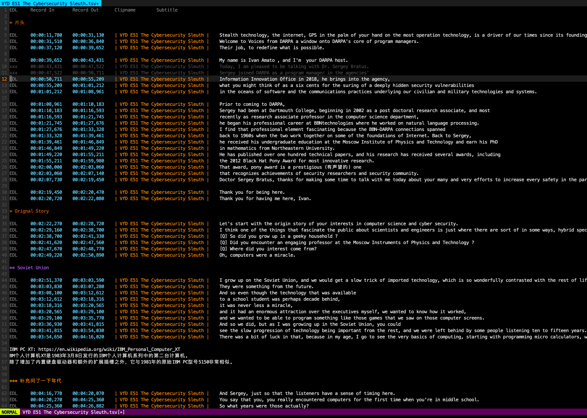
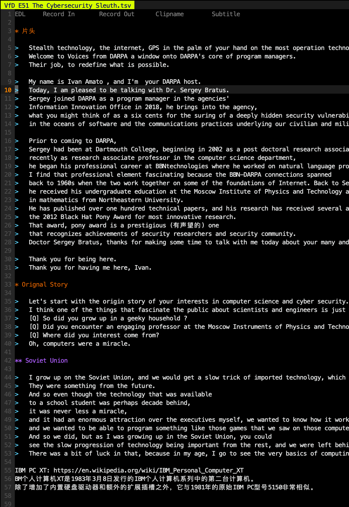

## Keys

### PREVIEW

| Key     | Function                                                         |
|---------|------------------------------------------------------------------|
| ⇥ (tab) | [mpv] play this line (guessing start pos at cursor), stop at end |
| ⇧⇥      | [mpv] play this line from start (no guessing pos), stop at end   |
| \ ⇥     | [mpv] play this line (from cursor), don't stop                   |
| ⎵       | [mpv] play line by line from this one till EOF                   |

### TIMECODE EDITING

| Key          | Function                                                           |
|--------------|--------------------------------------------------------------------|
| J            | Join (timecode) with the next line                                 |
| \|           | Split this line into two, guessing a new timecode                  |
| ⇧←/⇧→        | Roll timecode with the previous line for 1 sec                     |
| g0           | go to the start of subtitle                                        |
| g8           | go to `record_out` timecode in prev line                           |
| g9           | go to `record_in` timecode                                         |
| go           | append a gap for 5 secs below current line                         |
| \ c          | toggle conceallevel=0, 1                                           |

### EDITORIAL DECISION

| Key          | Function                                              |
|--------------|-------------------------------------------------------|
| \ p          | Enter cherry-pick mode. tabnew on the left, map ⏎     |
| ⏎ (enter)    | pick this line to Vim tab 1, then mark used `---`     |
| \ P          | Enter cherry-pick mode (split horizontally), map ⏎    |
| ⏎            | pick this line to next window, then mark used `---`   |
| ⌫ (BS)       | reject this line, mark `xxx`, then go to next line    |
| ⌦ (DEL, ⌥⌫)  | toggle between `EDL` and `xxx`; toggle `---` to `EDL` |
| V (region) ⎵ | render those highlighted lines with `tsv2roughcut`    |

### MPV IPC CONTROL MODE

| Key         | Function                                                                       |
|-------------|--------------------------------------------------------------------------------|
| \ \         | init. `mpv --input-ipc-server=/tmp/mpvsocket --pause clipname.mp4`             |
|             | and enter IPC Control mode. `s ← → ↑ ↓ ⎵ ⏎` is redefined, and restored at quit |
| \ \ (again) | send quit signal via ipc socket to mpc                                         |
| ←, →        | move, then [mpv ipc] seek to cursor                                            |
| ↑, ↓        | move, then [mpv ipc] seek; reload when clip changed                            |
| \ ⎵         | [mpv ipc] play from this line till EOF                                         |
| ⎵           | [mpv ipc] toggle play                                                          |
| ⏎, s        | [mpv ipc] seek to cursor                                                       |
| S           | [mpv ipc] search next (`n`), and seek                                          |
| \ s         | [mpv ipc] reverse seek: go to the line of mpv timecode. sync playhead          |
| \ S         | backwards of \ s                                                               |
| ⇥           | seek to cursor, [mpv ipc] alway play. if in comment region, jump to next 'EDL' |
| ⇧⇥          | seek to line head, then ⇥                                                      |

<details markdown="1"><summary>Click here to see full description of those keys</summary>

On media files tab, 

Press 'Enter' will:
 - Copy this line to the end of `tab 1`
 - Mark this line as used `---`
 - Move to the next line 

Press `Backspace` or `Delete` will:
 - Mark this line as rejected, mark `xxx` at the head of this line
 - Move to the next line

Press `Space` will:
 - Continous play lines start with `EDL`

<del>
 - Add a newline at the end of `tab 1`
 - Go back to current position
</del>

Press `Tab` will:
 - Invoke `mpv`/`ffplay` the `*clipname*.!(tsv|srt|txt)'` in current directory, starting from time `record_in`
 - Press `q` to stop
 - Will try to infer a playback timecode according to cursor position
    - `Shift-Tab` will bypass position guessing

Press `J` will:
 - Merge with next line, join those two timecode

Press `|` on a character will:
 - Split this line into two. 
 - Will guess out a new timecode in break point, by words length

Press `Shift-Left` or `Shift-Right` will:
 - Shift `Record In` timecode of this line to 1 sec left
 - Shift `Record Out` timecode of previous line to 1 sec left
 - This function is pretty much like 'Roll' operation in Davinci Resolve

Press `g0` will:
 - Go to the head of subtities.

Press `g9` will:
 - Go to `record_in` timecode. You may like this keybinding with `C-a` `C-x` to increase/decrease number.

</details>

*NOTE*: `:mksession` to save a `Session.vim` to the current folder may be very useful before reloading this session with `vim -S`.

## Overview

```
.srt --- [srt2tsv] --> .tsv file
                       |
		       V
		      Vim: proofread ---- [tsv2srt] ------> .srt file 
		       |                                       \- [audio2srtvideo]
		       |                                                \---> .mkv (with TC)
		       V
		      Vim: add notes and '* Section' '** Subsection'
		       |
		       V
		      Vim: Tab    (Preview)
		       |   Enter  (Select)
		       |   Delete (Reject)
		       |   cherry-pick / re-arrange
		       V 
	       Google Spreadsheet: Invite your editor friends to edit
		       |
		       |
		       \----> selected .tsv file 
		                |       \
				|	 \
			        |     [tsv2edl] --> .edl file
				|                         \
				v  	                   \--> DaVinci Resolve: fine tuning
			 [tsv2roughcut]	                              \
							               \
							                \---> Production
```



## Install

```bash
mkdir -p ~/.vim/pack/plugins/start; cd ~/.vim/pack/plugins/start
git clone https://github.com/scateu/tsv_edl.vim

#sudo apt install mpv ffmpeg jq socat
brew install mpv ffmpeg  
brew install jq socat   #for mpv IPC support

(sudo -E) make install-utils 
```

## .srt to .tsv

```bash
cd /path/to/srt/; srt2tsv_all
```

 - or: in vim, `:!srt2tsv_all`
 - or: in vim, `V` to mark a region, and press `:` then type `%!srt2tsv`, to filter this region through the corresponding util.

- .tsv format is defined as: (see `utils/srt2tsv.sh`)

```bash
cat some.srt | sed -n -r '1{/^$/n;};/^[0-9]+$/{n; s/ --> /\t/; s/$/\t| _CLIPNAME_ |\t/; N; s/\n//; h; d;}; /^$/! { H; $!d;}; x; s/\n/\\N/g; s/^/EDL\t/;p' > some.tsv
sed -i "" 's/_CLIPNAME_/some/' some.tsv
```

## tsv to srt

`tsv2srt` `tsv2srt_all`

tips: you may `s/，/, /g`, to make Chinese lines wrap. Otherwise ,`mpv` treat those as a bloody long line.

## Cherry-pick

```bash
vim -p selection1.tsv movie1.tsv podcast1.tsv podcast2.tsv movie2.tsv  #target has to be the first tab
```


## Conceal: Hide the first 4 columns

... to stay more focused when listening to tape.

```
:set conceallevel=1  (or 2. For short, :set cole=1)
```



## Assemble a rough cut

for example:

```bash
grep -C3 beep | tsv2rough
```

`-C` for context.

A file with the increasing number `roughtcut.mp4`, `roughtcut_1.mp4` ... will be generated.

## Assemble a EDL timeline

(You may want to change the `FPS` value in `utils/tsv2edl.py`)

```bash
grep EDL selection.tsv | tsv2edl > selection.edl
```

or with Makefile, you can do `:make` or `:make selection2.edl` or `:make %[Tab Key] [backspace..].edl` within vim.

```makefile
selection.edl: selection.tsv
	grep EDL $< | tsv2edl > $@
```

```makefile
%.edl: %.tsv
	grep EDL $< | tsv2edl > $@
```

Then import the .edl file into Davinci Resolve (Cmd-Shift-i) / Adobe Premiere. 
Or find your way to convert it to .fcpxml

*NOTE*: the starting TC of a source clip needs to be '01:00:00:00'. You may shift the clips in Davinci Resolve, or you change the `utils/tsv2edl.py` accordingly.

*NOTE*: If Davinci Resolve matches a wrong clip, you may create a new bin contains the only clip. Then you import EDL, click done, and in the next window, choose the only new bin.

*NOTE*: If the source slip is a pure audio file, you may create a timeline, lay down the audio file and rename the timeline exactly the same as the clipname. Starting timecode must match.

Or ...

## Convert MP3/Audio to a dummy video from .srt

Due to the limitation of Davinci Resolve that EDL file cannot be reconstructed into a timeline refering to pure audio file, 
a helper bash script is prepared in `utils/audio2srtvideo.sh`

```bash
audio2srtvideo "Some podcast E01.mp3"
```

will yield a `Some podcast E01.mkv`

*NOTE*: You may want to move those mkv files into a subdirectory named, for example, `mkvs`, so that `Tab` key `ffplay` will not be confused.

## mpv conf suggestion

~/.config/mpv/mpv.conf

```
screen=1
fs-screen=1
window-maximized=yes
geometry=100%
#profile=low-latency
#no-focus-on-open
#keep-open=always
#untimed=yes
```
## See Also

 - sc-im: spreadsheet in terminal
 - a [firefox podcast addon](http://podcasts.bluepill.life/), useful to download mp3 files
 - REFERENCE 
	- Python vs Vimscript [gist](https://gist.github.com/yegappan/16d964a37ead0979b05e655aa036cad0)
	- Vimscript cheatsheet: https://devhints.io/vimscript
 - BBC Paper Edit: [Slides](https://docs.google.com/presentation/d/1vVe_hgTj6JhLhU2WuZBOWx41ajcKX-8m8Xa0NIVZT2M/edit#slide=id.g6b51b79a88_2_245) | [github](https://github.com/bbc/digital-paper-edit-client) | [bbcnewslab](https://bbcnewslabs.co.uk/projects/digital-paper-edit/)

## TODOs

 - [X] Gap: EDLSPACE?  `go`
 - [ ] When there's only one tab, `Enter` should cease to work. 
 - [X] Tab/Space key on a visual region. render the region into a media file
 - [X] tsv2srt -reflow: reassign the timestamp of each srt block. generate a srt for the rendered region
 - [ ] mpv --input-ipc-server 

 - [X] bug: macOS: `set shell=/bin/bash` otherwise, in zsh, error will occur


## DEMO
 - Never, never. [Bilibili](https://www.bilibili.com/video/bv19b4y1e7Cn) [Youtube](https://youtu.be/avIspauKS3c)
