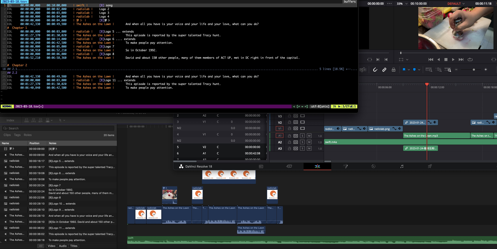
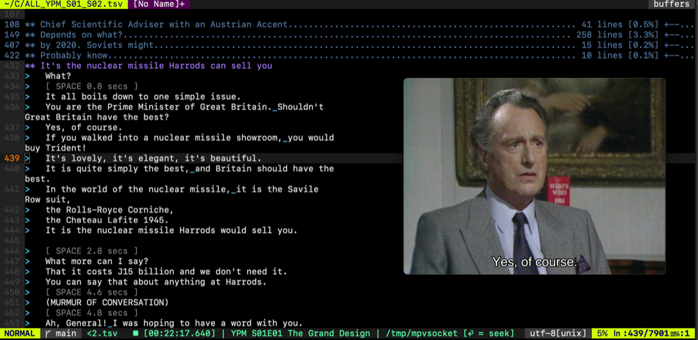
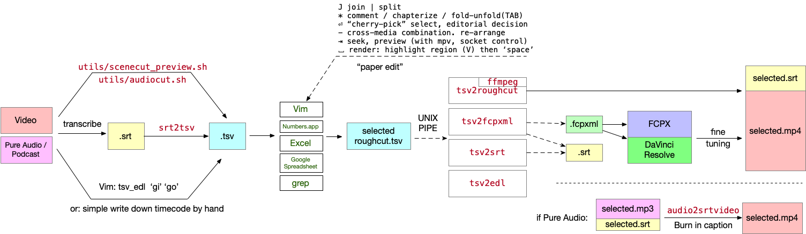
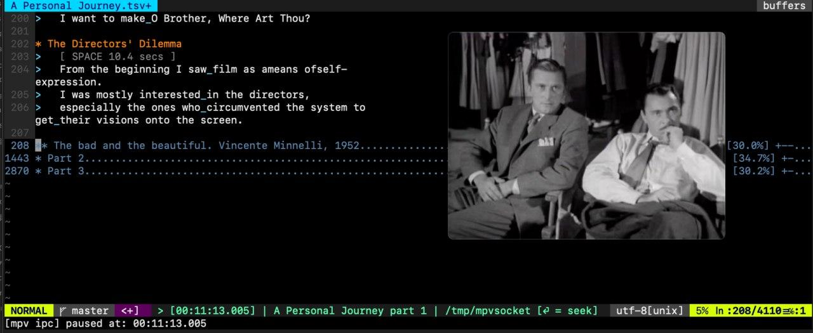
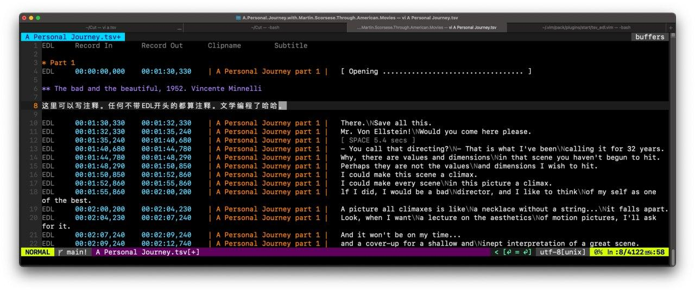
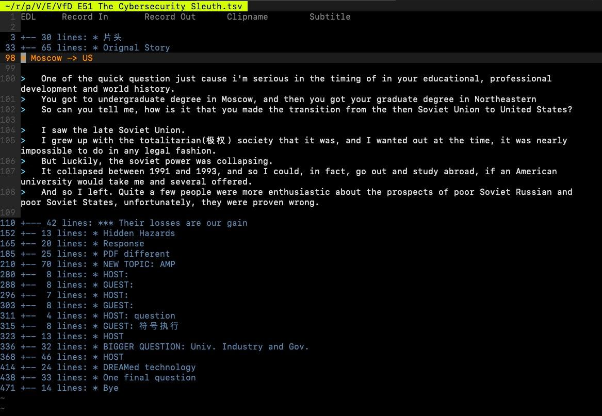
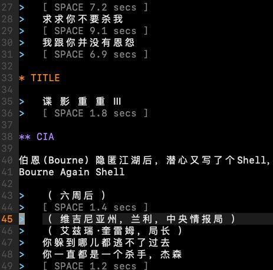
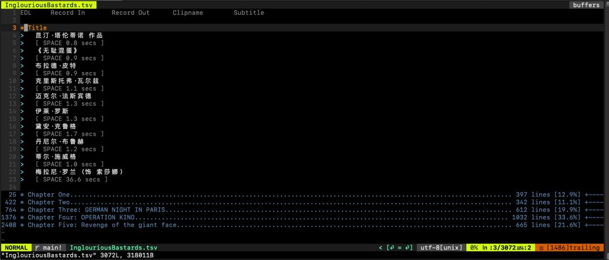
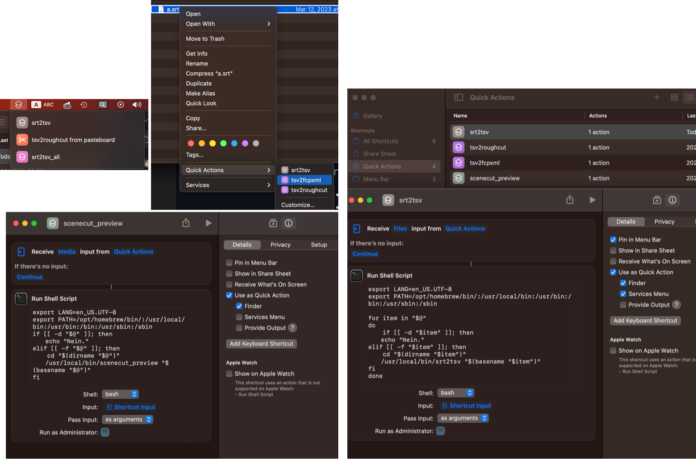

# Syntax

```
* Title
Any line without EDL in the beginning is a comment.

## Including this SubSection

EDL	00:00:01,000	00:00:05,000	| image |	subtitles….
EDL	00:00:01,000	00:10:01,422	| clipname |	[B]this is B-Roll
EDL	00:00:01,000	00:10:01,422	| clipname |	subtitles…. 
EDL	00:00:01,000	00:10:01,422	| clipname |	subtitles and\Nnewline

NOTE: Detail of tab and space described as follow
EDL⇥00:00:01,000⇥00:10:01,422⇥|⎵clipname⎵|⇥subtitles and\Nnewline

*** SubSubSection
Asterisk and sharp sign are equally treated.
```

Even `sed` is enough to do the transformation from `srt` to `tsv`. (However, sed doesn't stitch the gap of srt files. You still may want to use `srt2tsv.py`)

```bash
cat some.srt | sed -n -r '1{/^$/n;};/^[0-9]+$/{n; s/ --> /\t/; s/$/\t| _CLIPNAME_ |\t/; N; s/\n//; h; d;}; /^$/! { H; $!d;}; x; s/\n/\\N/g; s/^/EDL\t/;p' > some.tsv
# you may remember this dig TXT srt2tsv.scateu.me
sed -i "" 's/_CLIPNAME_/some/' some.tsv
```

## Key-bindings

[Cheatsheet / Reference Card](https://github.com/scateu/tsv_edl.vim/raw/main/tsv_edl_refcard.pdf)

### PREVIEW

| Key     | Function                                                         |
|---------|------------------------------------------------------------------|
| ⇥ (tab) | [mpv] play this line (guessing start pos at cursor), stop at end |
| ⇧⇥      | [mpv] play this line from start (no guessing pos), stop at end   |
| \ ⇥     | [mpv] play this line (from cursor), don't stop                   |
| \ ⎵     | [mpv] play line by line from this one till EOF                   |

### TIMECODE EDITING

| Key   | Function                                                                                                     |
|-------|--------------------------------------------------------------------------------------------------------------|
| J     | Join (timecode) with the next line; If on the first of two http lines with timestamp, will made an EDL line. |
| \|    | [split] this line into two, guessing a new timecode                                                          |
| mm    | mark/unmark word break point, then [split] will use this and cursor together.                                |
|       | useful when cut time not predicted well.                                                                     |
| ⇧← ⇧→ | Roll timecode with the previous line for 1 sec                                                               |
| g0    | go to the start of subtitle                                                                                  |
| g8    | go to `record_out` timecode in prev line                                                                     |
| g9    | go to `record_in` timecode                                                                                   |
| gO    | append a gap for 5 secs below current line                                                                   |
| gN    | append a line for 10 minutes below current line, place cursor to input clipname                              |
| gB    | toggle a line between '[B]' or not.                                                                          |
| gb    | the same as gB                                                                                               |
| gc    | calculate duration of this line, append to the end.                                                          |
| \ c   | toggle conceallevel=0, 1 ; `:set nowrap` may help you.                                                       |

### EDITORIAL DECISION / BBC Paper Edit

| Key          | Function                                              |
|--------------|-------------------------------------------------------|
| \ p          | Enter cherry-pick mode. tabnew on the left, map ⏎     |
| ⏎ (enter)    | pick this line to Vim tab 1, then mark used `---`     |
| \ P          | Enter cherry-pick mode (split horizontally), map ⏎    |
| ⏎            | pick this line to next window, then mark used `---`   |
| ⌫ (BS)       | reject this line, mark `xxx`, then go to next line    |
| ⌦ (DEL, fn⌫) | toggle between `EDL` and `xxx`; toggle `---` to `EDL` |
| V (region) ⎵ | render those highlighted lines with `tsv2roughcut`    |
| V  x         | export those highlighted lines with `tsv2fcpxml`      |

### MPV IPC CONTROL MODE

| Key         | Function                                                                             |
|-------------|--------------------------------------------------------------------------------------|
| \ \         | init. `mpv --input-ipc-server=/tmp/mpvsocket --pause clipname.mp4`                   |
|             | and enter IPC Control mode. `s ← → ↑ ↓ ⎵ ⏎` are redefined, and restored at quit      |
| \ \ (again) | send quit signal via ipc socket to mpv                                               |
| ⎵           | [mpv ipc] toggle play                                                                |
| ←  →        | move, then [mpv ipc] seek to cursor                                                  |
| ↑  ↓        | move, then [mpv ipc] seek; reload when clip changed                                  |
| \ ⎵         | [mpv ipc] play from this line till EOF                                               |
| ⏎ or s      | [mpv ipc] seek to cursor                                                             |
| ns          | [mpv ipc] search next (`n`), and seek                                                |
| S           | [mpv ipc] sync playhead: seek vim cursor to nearest of mpv timecode, wrap end        |
| \ S         | backwards of sync playhead                                                           |
| gS          | playhead sync periodically, every 1s. call again to dismiss. ⎵ will pause and restore status |
| ⇥           | seek to cursor, [mpv ipc] always play. if in comment region, jump to next 'EDL'      |
| ⇧⇥          | seek to line head, then ⇥                                                            |
| gi          | [mpv ipc] get current timecode, write record_in. overwrite existing.                 |
| go          | [mpv ipc] get current timecode, write record_out and clipname. overwrite existing    |
| -           | get current timecode from mpv, write to the 'out' of this line. move down, write the same as 'in' |
|             | very useful when adding timecode to a plain text transcription.                         |


### Orgmode/Markdown Folding

| Key | Function                                                               |
|-----|------------------------------------------------------------------------|
| ⇥   | When not on a EDL/---/xxx line. do `za` on `## Header` or `* Org head` |
| ⇧⇥  | cycle foldlevel=0,1,2                                                  |
|     | if on a EDL line, you have to use `za` `zm` `zr` `zo` `zO` `zM` `zR`   |
| ]]  | go to next heading                                                     |
| [[  | go to previous heading                                                 |
| g]  | go to next comment line (not start with EDL)                           |
| g[  | go to previous comment line (not start with EDL)                       |


## Screenshots









# Install

## on macOS with homebrew

```bash
mkdir -p ~/.vim/pack/plugins/start; cd ~/.vim/pack/plugins/start
git clone https://github.com/scateu/tsv_edl.vim
#git clone https://github.com/vim-airline/vim-airline
#git clone https://github.com/pR0Ps/molokai-dark
make install-utils 
brew install mpv ffmpeg  #sudo apt install mpv ffmpeg jq socat
brew install jq socat   #for mpv IPC support

#brew install macvim
```

then, put the following lines to `~/.vimrc`

```vim
"set fencs=utf-8,gbk
filetype plugin indent on "especially this line.
syntax on
set laststatus=2 
set number
set anti "macOS anti alias
let g:airline#extensions#tabline#enabled = 1
colorscheme molokai-dark
```

## on macOS without homebrew

<details markdown="1"><summary>Click here to see full instructions</summary>

```bash
#sudo mkdir /usr/local/bin
#echo 'PATH=$PATH:/usr/local/bin' >> .zshrc
#echo 'PATH=$PATH:/usr/local/bin' >> .bashrc
mkdir -p ~/.vim/pack/plugins/start; cd ~/.vim/pack/plugins/start
git clone https://github.com/scateu/tsv_edl.vim
git clone https://github.com/vim-airline/vim-airline
git clone https://github.com/pR0Ps/molokai-dark
cd tsv_edl.vim; make install-utils
echo 'filetype plugin indent on' >> ~/.vimrc
echo 'syntax on' >> ~/.vimrc
echo 'set laststatus=2' >> ~/.vimrc
echo 'let g:airline#extensions#tabline#enabled = 1' >> ~/.vimrc
echo 'colorscheme molokai-dark' >> ~/.vimrc
make install-depends-on-mac-no-homebrew
```
</details>


```bash
#test
srt2tsv -a
vim -p example.tsv example_never.tsv

# you may want macvim for GUI https://github.com/macvim-dev/macvim/releases/tag/snapshot-172
```


### macOS: Finder Integration with Shortcuts.app

 - <del> see [utils/apple_automator/README.md](utils/apple_automator/README.md) </del>
 - see [README.macOS.shortcuts.md](README.macOS.shortcuts.md)




# 1. Utils

## 1.1 srt2tsv

```bash
cd /path/to/srt/; srt2tsv -a
srt2tsv a.srt  #generates a.tsv
```

 - or: in vim, `:!srt2tsv -a`
 - or: in vim, `V` to mark a region, and press `:` then type `%!srt2tsv`, to filter this region through the corresponding util.

- .tsv format is defined as: (see `utils/srt2tsv.sh`)


 - *TIPS* for European subtitles: `for i in *.srt; do iconv -f CP1251 -t UTF-8 "$i" > converted/"$i";done`
 - *TIPS* to count lines: `cat *.srt | dos2unix |grep .  |sed  -r '/^[0-9]+$/{N;d;}' | grep -v Downloaded |wc -l`
 - See also: [VideoSubFinder](https://sourceforge.net/projects/videosubfinder/), [roybaer/burnt-in-subtitle-extractor: Set of basic extraction tools for burnt-in subtitles, i.e. subtitles that are part of the picture itself](https://github.com/roybaer/burnt-in-subtitle-extractor), [SubRip](http://zuggy.wz.cz/), [ocr 1](https://github.com/shenbo/video-subtitles-ocr), [ocr 2](https://github.com/broija/subdetection)

## 1.2 tsv2srt

`tsv2srt` `tsv2srt_all`

tips: you may `s/，/, /g`, to make Chinese lines wrap. Otherwise ,`mpv` treat those as a bloody long line.

## 1.3 tsv2roughcut: Assemble a rough cut with ffmpeg

```bash
cat selection.tsv | tsv2roughcut  #will generate roughtcut.mp3/mp4, srt. auto increase filename
cat selection.tsv | tsv2roughcut --user-input-newname 
# will ask in the end. do not input ext name. dirname/clipname is supported
# e.g.  clips/a good one

cat selection.tsv | head -n 30 | tsv2roughcut test/"good one"
cat selection.tsv | tail -n 30 | tsv2roughcut test/good\ two
cat selection.tsv | grep good | tsv2roughcut "test/good three"
cat *.tsv | grep -C3 -i beep | tsv2roughcut #context 3 lines, ignore case
```
## 1.4 tsv2fcpxml

NOTE: `tsv2edl` is not well-maintained.

```bash
cat selection.tsv | tsv2edl > sel.edl #then import in DaVinci Resolve
cat selection.tsv | tsv2fcpxml > sel.fcpxml  #24FPS, 48000Hz, change it accordingly
```
## 1.5 auto2srtvideo: Convert MP3/Audio to a dummy video from .srt

Due to the limitation of Davinci Resolve that EDL file cannot be reconstructed into a timeline refering to pure audio file, 
a helper bash script is prepared in `utils/audio2srtvideo.sh`

```bash
audio2srtvideo "Some podcast E01.mp3"
```

will yield a `Some podcast E01.mkv`

*NOTE*: You may want to move those mkv files into a subdirectory named, for example, `mkvs`, so that `Tab` key `ffplay` will not be confused.

# 2. Modes / Use cases

## 2.1 Cherrypick

```bash
vim -p selection1.tsv movie1.tsv podcast1.tsv podcast2.tsv movie2.tsv  #target has to be the first tab
```

*NOTE*: `:mksession` to save a `Session.vim` to the current folder may be very useful before reloading this session with `vim -S`.


## 2.2 preview / IPC control

*TIPS* tsv file can be place separatedly from media file. 1) You can do `ln -s` soft link. 2) You may change working directory inside `vim` by `:cd /Volumes/usbshare2-2/nas/TVSeries/Yes.Prime.Minister`

Press `\\` twice to init mpv ipc control and bring up mpv. Will try best to reuse existing mpv ipc control channel `/tmp/mpvsocket`

## 2.3 mark in/out style

```
EDL     00:24:00,000    00:30:00,000    | clipname |   ......;
```

**Tips:** 神笔马良(Magic Pen). for 60 minutes, 6 + 1 chars are needed.

```
EDL	00:00:00,000	01:00:00,000	| clipname |	......;
```

For example, use ←/→ on the dots, to seek by 10 minutes. 
You can draw a progress bar on the fly. Isn't that cool?

Then `gi`, `go`.

## 2.4 \c Vim Conceal: Hide the first 4 columns

... to stay more focused when listening to tape.

```
:set conceallevel=1  (or 2. For short, :set cole=1)
```


It's mapped to `\ c` for your convenience.

## See Also

 - sc-im: spreadsheet in terminal
 - a [firefox podcast addon](http://podcasts.bluepill.life/), useful to download mp3 files
 - REFERENCE 
	- Python vs Vimscript [gist](https://gist.github.com/yegappan/16d964a37ead0979b05e655aa036cad0)
	- Vimscript cheatsheet: https://devhints.io/vimscript
 - BBC Paper Edit: [Slides](https://docs.google.com/presentation/d/1vVe_hgTj6JhLhU2WuZBOWx41ajcKX-8m8Xa0NIVZT2M/edit#slide=id.g6b51b79a88_2_245) | [github](https://github.com/bbc/digital-paper-edit-client) | [bbcnewslab](https://bbcnewslabs.co.uk/projects/digital-paper-edit/)
 - [AVID Media Composer - PhraseFind Option](https://www.avid.com/zh/products/media-composer-phrasefind-option)
 - <https://podcast.adobe.com>
 - [Steve Audette, ACE](https://www.youtube.com/watch?v=6hW5FR8rYm4) \| [Walter Murch](https://www.youtube.com/watch?v=KuUUP2eP1_k)

## DEMO
 - Never, never. [Bilibili](https://www.bilibili.com/video/bv19b4y1e7Cn) [Youtube](https://youtu.be/avIspauKS3c)
 - `cat V Dont.Look.Up Inglourious No.Country.for.Old.Men The.Bourne.Supremacy 谍影重重3 Notting.Hill | grep -e god -e love -e beep -e shit | sort` [B](https://www.bilibili.com/video/BV1RZ4y1S7JA/)


[中文介绍](http://scateu.me/2023/03/19/tsv_edl.vim.html)
